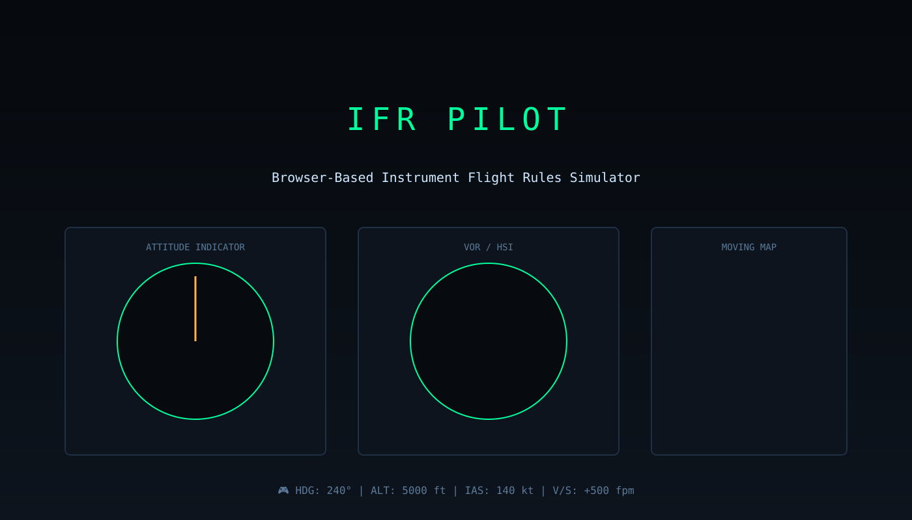

# IFR Pilot ✈️

**Master instrument flying in your browser.** Navigate through the skies using only your cockpit instruments—no outside visual references allowed. Control heading, altitude, and airspeed while tracking VORs and following your moving map. A realistic flight simulator experience that runs entirely in your web browser.

🎮 **Play Now:** Just open `index.html` or visit the [live demo](http://crgar-liliput.swedencentral.cloudapp.azure.com/dev/crgarcia12/ifr-pilot/liliput-task-2a5c7897/)

### Features
- **Attitude Indicator**: Monitor pitch and bank in real-time
- **VOR/HSI Navigation**: Track radio beacons and maintain your course
- **Moving Map**: See your position and plan your route
- **Full Autopilot**: HDG, ALT, and IAS hold modes with v-speed control
- **Realistic Physics**: Authentic flight dynamics and instrument behavior
- **Keyboard Controls**: Intuitive controls for heading, altitude, and speed

Perfect for aviation enthusiasts, student pilots practicing IFR procedures, or anyone who wants to experience the challenge of instrument flight!
